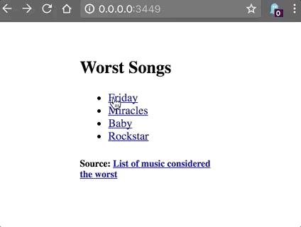

# re-frame-routing-demo

A [re-frame](https://github.com/Day8/re-frame) application designed to demonstrate how to setup routing using Bidi +
Pushy.



## Development Mode

### Run application:

```
lein clean
lein figwheel dev
```

Figwheel will automatically push cljs changes to the browser.

Wait a bit, then browse to [http://localhost:3449](http://localhost:3449).
